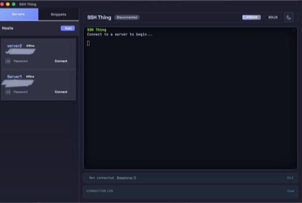

# SSH Thing

SSH Thing is a cross-platform desktop SSH client built with Tauri, a Rust backend, and a vanilla HTML/JS frontend. It focuses on quick connections, clear session state, and a straightforward terminal experience, with small, fast binaries and minimal overhead.



### Highlights
- Manage multiple saved servers with nicknames, users, and ports.
- One-click connect/disconnect with clear status indicators.
- Built-in host key prompts and basic credential storage.
- Simple, keyboard-friendly terminal view for everyday SSH tasks.

Have feature ideas or requests? Please open an issue in the **Issues** tab.

## Running unsigned builds (macOS & Windows)

SSH Thing is not code signed yet (no Apple Developer ID or Windows Authenticode cert), so operating systems will treat fresh downloads as untrusted. Here is what to expect:

### macOS (DMG install)

1. Mount the `.dmg` and drag **SSH Thing** into **Applications**.
2. **Immediately run this command** (removes the quarantine/xattr flags Gatekeeper adds to unsigned apps):

   ```bash
   sudo xattr -cr /Applications/ssh-thing.app
   ```

   This has been the most reliable way to launch on multiple Macs without needing a developer account.
3. Launch the app from **Applications**. If macOS still warns you, either:
   - right-click → **Open** and confirm, or
   - go to **System Settings → Privacy & Security → Security → Open Anyway** after the first blocked attempt.

For rare "app is damaged" dialogs, the stricter variant works too:

```bash
xattr -dr com.apple.quarantine /Applications/ssh-thing.app
```

See `MACOS_INSTALL.md` for more background on the Gatekeeper flow.

### Windows (SmartScreen)

Unsigned `.msi/.exe` bundles can trigger Windows Defender SmartScreen. When the blue dialog appears:

1. Click **More info**.
2. Press **Run anyway** to continue the install.

After the first approval, Windows will remember the decision for future launches.
