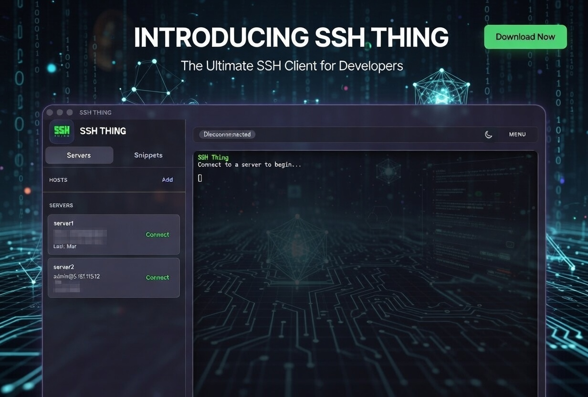

# SSH Thing

SSH Thing is a cross-platform desktop SSH client built with Tauri (Rust backend) and a vanilla HTML/JS frontend. It's designed for users who want a lightweight, focused tool that prioritizes the features they actually use — without the unnecessary bloat of larger SSH clients.



## Why SSH Thing?

I built SSH Thing because I was tired of SSH clients that tried to do everything under the sun. I wanted a tool that was:
- **Lightweight**: Small executable size with minimal system overhead
- **Focused**: Just the features I use daily — no unnecessary bells and whistles
- **Fast**: Quick to start and responsive to use
- **Simple**: Clean interface that gets out of the way

SSH Thing isn't trying to be the most feature-rich SSH client. It's trying to be the best one for people who want to connect to servers quickly and reliably.

## Features

### Core Functionality
- **Server Management**: Save and organize your frequently used servers with nicknames, usernames, and port numbers
- **One-Click Connections**: Connect and disconnect with a single click
- **Clear Status Indicators**: Easy-to-read connection status and terminal feedback
- **Terminal Experience**: Keyboard-friendly terminal with support for search, scrollback, and terminal settings
- **Basic Credential Storage**: Securely store credentials using the system's native keychain

### Quality of Life Features
- **Dark/Light Theme**: Toggle between dark and light modes
- **Focus Mode**: Hide the sidebar and chrome to maximize terminal space
- **Terminal Settings**: Customize font size and scrollback buffer
- **Connection Log**: Keep track of your connection history
- **Session Management**: Manage multiple concurrent SSH sessions

## Download and Installation

### Pre-built Binaries

Download the latest release from the [Releases page](https://github.com/yourusername/ssh-thing/releases).

### Code Signing Workaround

SSH Thing is not currently code signed (no Apple Developer ID or Windows Authenticode certificate), so your operating system may treat it as untrusted. Here's how to work around this:

#### macOS (DMG Install)
1. Mount the `.dmg` file and drag **SSH Thing** into your **Applications** folder
2. If macOS says "SSH THING is damaged and can't be opened", open Terminal and run:
   ```bash
   sudo xattr -cr "/Applications/SSH THING.app"
   ```
3. Launch SSH Thing from **Applications**
4. If you still see a warning, right-click the app and select **Open**

#### Windows (SmartScreen)
1. Download and run the `.msi` installer
2. If Windows Defender SmartScreen blocks the install:
   - Click **More info**
   - Click **Run anyway** to continue the installation

## Building from Source

If you'd like to build SSH Thing from source, follow these steps:

### Prerequisites
- **Rust**: Install Rust from [rust-lang.org](https://www.rust-lang.org/)
- **Tauri**: Follow the [Tauri setup guide](https://tauri.app/v1/guides/getting-started/prerequisites/)

### Build Instructions
1. Clone the repository:
   ```bash
   git clone https://github.com/yourusername/ssh-thing.git
   cd ssh-thing
   ```
2. Install dependencies:
   ```bash
   npm install
   ```
3. Run the app in development mode:
   ```bash
   npm run tauri dev
   ```
4. Build the app for production:
   ```bash
   npm run tauri build
   ```

## Usage

### Adding a Server
1. Click the **Add** button in the Servers tab
2. Enter the server details:
   - **Nickname**: A friendly name for the server
   - **Host**: The server's IP address or hostname
   - **Port**: The SSH port (default: 22)
   - **Username**: Your SSH username
   - **Password/Private Key**: Choose your authentication method
3. Click **Save**

### Connecting to a Server
1. Click on a server in the Servers list
2. If prompted, enter your password or select your private key
3. The terminal will connect and you'll see the remote shell prompt

### Managing Snippets
1. Click the **Snippets** tab
2. Click **Add** to create a new snippet
3. Enter a title and the command you want to save
4. Click **Save**
5. To use a snippet, click on it from the list — it will be pasted into the active terminal

## Contributing

If you'd like to contribute to SSH Thing, please feel free to open an issue or submit a pull request. Feature requests are also welcome!

## License

SSH Thing is open source software licensed under the [MIT License](LICENSE).
