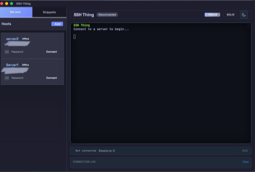

# SSH Thing

SSH Thing is a cross-platform desktop SSH client built with Tauri, a Rust backend, and a vanilla HTML/JS frontend. It focuses on quick connections, clear session state, and a straightforward terminal experience, with small, fast binaries and minimal overhead.



### Highlights
- Manage multiple saved servers with nicknames, users, and ports.
- One-click connect/disconnect with clear status indicators.
- Built-in host key prompts and basic credential storage.
- Simple, keyboard-friendly terminal view for everyday SSH tasks.

Have feature ideas or requests? Please open an issue in the **Issues** tab.

## Releases with GitHub Actions

GitHub builds release binaries when you push a version tag.

1. Update the version in `package.json`, `Cargo.toml` (`[workspace.package]`), and `src-tauri/tauri.conf.json`.
2. Commit the version bump to `main`.
3. Create and push a matching tag:

   ```bash
   git tag v0.1.0
   git push origin main --tags
   ```

The release workflow validates that the tag matches the checked-in version and then builds:
- Linux: `.AppImage` and `.deb`
- Windows: `.msi` and NSIS `.exe` if generated
- macOS: `.dmg`

Pull requests and branch pushes run CI separately for formatting, clippy, tests, `cargo check`, and a cross-platform Tauri bundle smoke test.

To automate the version bump, commit, and tag creation, run:

```bash
./scripts/release-tag.sh 0.1.0
```

Or do the same and push immediately:

```bash
./scripts/release-tag.sh 0.1.0 --push
```

You can also run it through npm:

```bash
npm run release:tag -- 0.1.0 --push
```

## Running unsigned builds (macOS & Windows)

SSH Thing is not code signed yet (no Apple Developer ID or Windows Authenticode cert), so operating systems will treat fresh downloads as untrusted. Here is what to expect:

### macOS (DMG install)

1. Mount the `.dmg` and drag **SSH Thing** into **Applications**.
2. If macOS says **“SSH THING” is damaged and can’t be opened**, that is Gatekeeper, not actual file corruption.
3. Right now the macOS build is unsigned and not notarized. On recent macOS versions, that can show up as “is damaged and can’t be opened” instead of giving you the normal **Open Anyway** path.
4. Try this after dragging it into **Applications**:

   ```bash
   sudo xattr -cr "/Applications/SSH THING.app"
   ```

5. If that still doesn’t do it, use the stricter form:

   ```bash
   sudo xattr -dr com.apple.quarantine "/Applications/SSH THING.app"
   ```

6. Launch the app from **Applications**. If macOS still warns you, either:
   - right-click → **Open** and confirm, or
   - go to **System Settings → Privacy & Security → Security → Open Anyway** after the first blocked attempt.

This has been the most reliable way to launch on multiple Macs without needing a developer account.

See `MACOS_INSTALL.md` for more background on the Gatekeeper flow.

### Windows (SmartScreen)

Unsigned `.msi/.exe` bundles can trigger Windows Defender SmartScreen. When the blue dialog appears:

1. Click **More info**.
2. Press **Run anyway** to continue the install.

After the first approval, Windows will remember the decision for future launches.
